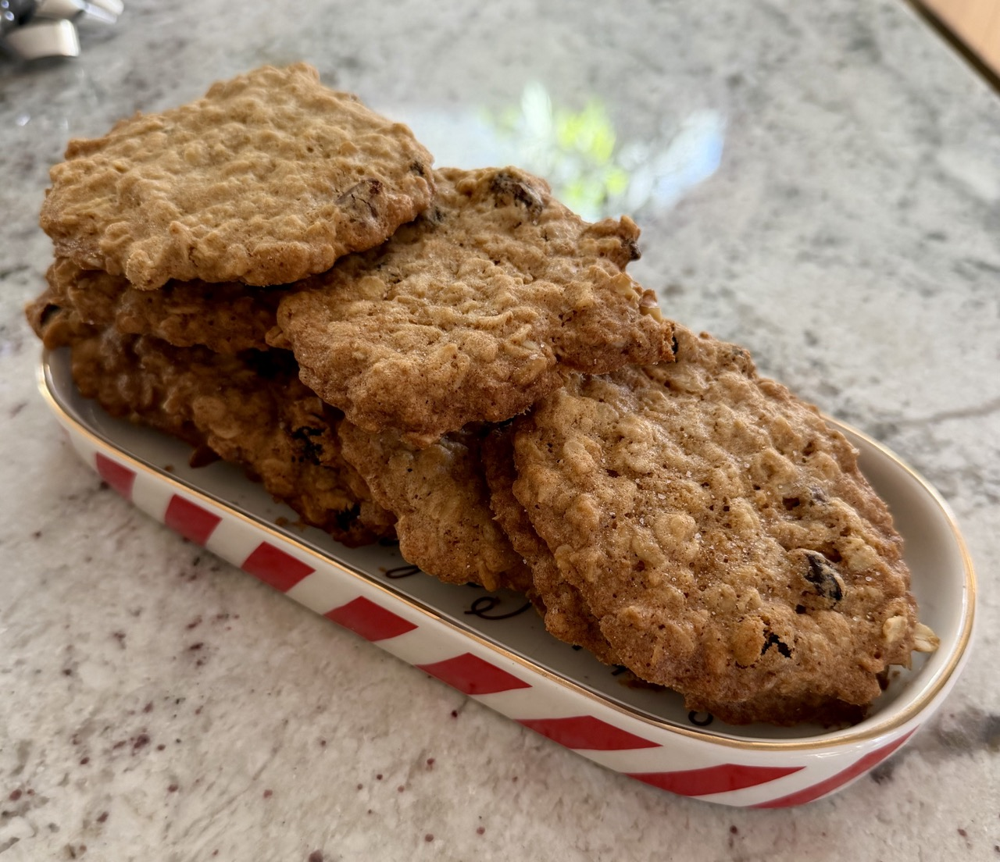



# Oatmeal Chocolate Chip Cookies

Crispy, salty, delicious.

**Author:** Christian Adams

**Yield:** Makes 3 dozen, 4 pans worth.

## Ingredients

* 1 cup / 227 grams (2 sticks) unsalted butter, softened
* 1 cup / 200 grams dark brown sugar, packed
* ⅓ cup / 66 grams granulated sugar
* 2 large eggs
* 1 tablespoon / 15 milliliters vanilla extract
* 1½ cups / 187 grams all-purpose flour
* ¾ teaspoon salt
* 1 teaspoon baking soda
* 1 teaspoon ground cinnamon
* ¼ teaspoon freshly grated nutmeg
* ½ teaspoon ground cardamom
* ½ teaspoon ground ginger
* 2½ cups rolled oats (not instant)
* ½ cup raisins
* ½ cup chopped walnuts
* ½ cup semi-sweet chocolate chips

## Directions

1. Heat oven to 350 degrees F. Butter two large cookie sheets, or line them with parchment paper or reusable silicone liners.
2. Using an electric mixer, beat butter in a large bowl until creamy. Add brown and granulated sugars, then beat until fluffy, about 2 minutes. Beat in eggs, one at a time, until fully incorporated. Then, beat in vanilla extract.
3. In a separate bowl, use a wooden spoon or spatula to mix together the flour, salt, baking soda, cinnamon, nutmeg and cardamom.
4. Set mixer on low speed, and beat flour mixture into the butter mixture.
5. Fold in oats, raisins, walnuts, and chocolate chips.
6. Spoon out dough by large tablespoonfuls onto prepared cookie sheets, leaving at least 2 inches between each cookie.
7. Bake until cookie edges turn golden brown, about 9 to 13 minutes. Centers will still be quite soft, but they will firm up as the cookies cool. Cool on a wire rack, and optionally grind finishing salt on top. Store in an airtight container at room temperature.

_Enjoy!_
